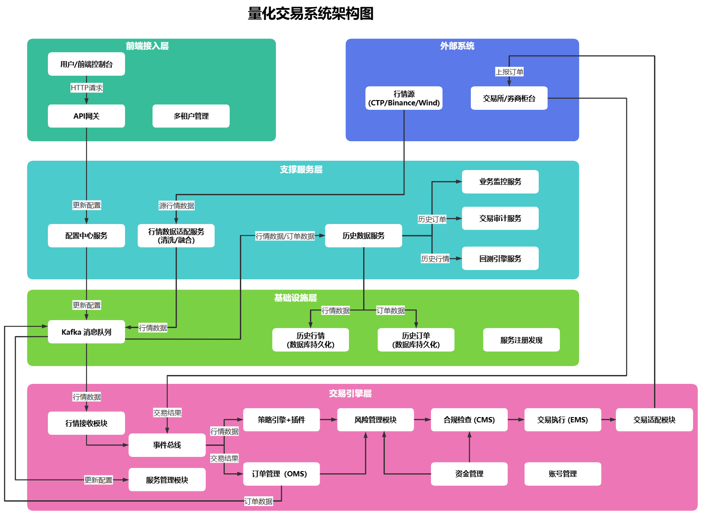

# 量化交易系统架构设计

## 一、系统定位与目标

### 1.1 系统定位

本系统定位为**面向机构客户的企业级多租户量化交易平台**，采用**纯行情驱动、单进程封闭交易引擎**的安全架构，支撑从策略研发、回测、仿真交易到实盘交易的全生命周期管理，适配高频交易场景，满足金融机构合规、高可用、高性能、可扩展、可审计的核心诉求，支持多账户、多交易所、多策略并行运行，具备跨地域部署与容灾能力。

### 1.2 核心目标

- **极致性能**：核心交易链路平均延迟 < 50 微秒，峰值订单处理能力 ≥ 10 万笔 / 秒；

- **金融级高可用**：核心交易层全年可用性 ≥ 99.99%，支撑跨机房灾备，故障恢复时间（RTO）< 30 秒，数据恢复点目标（RPO）< 1 分钟；

- **多租户隔离**：支持机构内多部门 / 多团队隔离，资源（CPU / 内存 / 行情 / 订单通道）按需分配，数据与操作权限严格隔离；

- **合规可控**：满足金融监管要求（如交易留痕、反洗钱、异常交易监控），支持等保三级、数据脱敏与跨境数据合规；

- **全生命周期可观测**：覆盖指标、日志、链路、调用链全维度监控，支持根因分析与性能溯源；

- **弹性扩展**：核心层按分片水平扩展（每分片 Active-Passive）；支撑服务层秒级弹性伸缩

- **封闭安全**：交易**数据面**仅由内部行情事件驱动发单；**控制面**（策略启停、参数变更、配置下发）经配置中心异步投递，引擎不暴露任何外部 TCP/HTTP 直连控制口，杜绝绕过审计的人为干预；

### 1.3 性能指标口径与热路径定义

为避免验收口径歧义，性能目标按下述**分段计量**，不在单一指标中混写「进程内内存决策」与「持久化 / 网络 / 跨服务」耗时。

#### 1.3.1 链路分段（验收边界）

| 分段 | 是否计入 50μs 目标 | 说明 |
|---|---|---|
| **A. 内存决策链** | **是** | 行情入队 → 策略回调 → CMS/风控 → OMS 内存状态更新 → EMS 内存队列入队 |
| **B. 异步持久化** | **否** | OMS WAL、合规日志、内存快照：独立 I/O 线程 / 批量 fsync，**不得阻塞 A 段同线程** |
| **C. 出站发单** | **单独 SLA** | EMS → 执行适配器 → 交易所/券商 RTT，与 A 段分别压测与对外承诺 |
| **D. 旁路上报** | **否** | 经 `log_client` / `monitor_client` 等异步接口上报，单向 fire-and-forget，不等待响应 |

- **「核心交易链路」** 特指 **A 段**；典型路径：标准化行情入队 → 策略回调与信号生成 → CMS 合规校验 → 实时风控 → OMS 内存校验 → EMS 入队。

- **「平均延迟 < 50 微秒」**：A 段在稳态、CPU 亲和绑定、无策略复杂计算条件下的 **P99 目标**（非全链路）；B/C/D 段**分别验收**。

- **「峰值订单处理能力 ≥ 10 万笔 / 秒」**：多引擎实例按 **租户 + 账户 + 品种** 分片后的**聚合吞吐**；单进程基准需单独压测（见 §1.3.2）。

#### 1.3.2 基准压测场景（单进程）

| 场景 | 延迟目标（P99） | 说明 |
|---|---|---|
| 空策略 passthrough | < 20μs | 仅验证 EventBus + OMS + EMS 骨架 |
| 1 策略 + CMS + 全量风控 | < 50μs | MVP 默认验收场景 |
| N 策略并行 + M 品种 | 单独指标 | 不纳入 50μs 统一承诺，按客户部署压测报告交付 |

#### 1.3.3 控制面与数据面

| 平面 | 驱动来源 | 允许操作 | 禁止操作 |
|---|---|---|---|
| **数据面** | Tick/Bar/订单回报事件 | 策略逻辑、发单/撤单信号、风控拦截 | 外部 HTTP/TCP 直连触发交易 |
| **控制面** | 配置中心 ← gRPC Watch ← 引擎控制线程（出站订阅） | 策略启停/暂停、参数热更新、分片规则变更 | 绕过配置中心直接改引擎内存；同步阻塞热路径 |

控制面变更**不产生订单**，仅改变策略生命周期或配置快照；生效后由下一 Tick 事件自然驱动数据面。

---

## 二、系统架构总览


图片地址：https://www.processon.com/v/69ff275de3b4723038f29cb6


### 架构层次：

本系统采用 “**核心模块进程内模块化集成 \+ 支撑功能微服务化 \+ 可插拔实现 \+ 企业级治理与容灾**” 的混合架构，平衡低延迟交易需求与企业级系统的稳定性、扩展性、合规性。

整体分为四层：

- **核心交易层**：进程内模块化设计，处理实时交易链路（微秒级响应），补充故障隔离、多核优化、本地容灾能力

- **支撑服务层**：独立部署的微服务集群，提供非实时性支撑功能，强化服务治理、熔断降级、弹性伸缩能力

- **接入层**：负责外部系统对接与用户交互，补充多租户、统一认证、安全网关能力

- **企业级治理层**：跨层治理能力，覆盖服务注册发现、配置灰度、容灾备份、合规审计、可观测性等企业级能力

### 核心设计原则：

- **低延迟优化**：A 段（§1.3.1）全程进程内内存交互；CPU 亲和性绑定，内存锁优化，网卡中断隔离；持久化与旁路上报异步化

- **高可用性**：核心模块多实例部署 \+ 跨机房灾备，微服务集群化 \+ 熔断降级，关键组件主备切换 \+ 故障自动转移

- **可扩展性**：通过插件机制扩展数据源 / 策略 / 执行渠道，无需修改核心代码；支撑服务层支持水平扩容，核心层支持多进程分片部署

- **安全性**：多层风控（事前 / 事中 / 事后），操作审计，数据加密传输，多租户权限隔离，等保三级合规，敏感数据脱敏

- **可维护性**：模块化边界清晰，微服务独立升级，插件化降低耦合，全维度可观测，自动化运维（发布 / 回滚 / 监控）

- **多租户隔离**：资源隔离、数据隔离、权限隔离，租户级配置与策略独立管理

- **合规性**：全流程交易留痕，审计日志不可篡改，满足金融监管与行业合规要求

- **命名规范**：所有目录、文件、模块、接口严格遵循 **Google C\+\+ 命名规范**

- **负载均衡优化**：行情层按阶段引入分片与主备切换（详见 §7.1.3）；MVP 仅固定哈希分片，不做运行时迁移

### 2.1 热路径与非热路径划分

- **热路径（A 段，§1.3.1）**：行情解析 → 事件总线 → 策略触发 → CMS → 风控 → OMS 内存更新 → EMS 入队；**同线程禁止**：同步阻塞、调用支撑服务、等待磁盘 fsync、等待远程 I/O 响应。

- **准热路径（B 段，异步）**：OMS WAL、合规日志、内存快照；专用 I/O 线程批量写入，与 A 段线程解耦。

- **非热路径（D 段旁路）**：日志、监控、历史、审计等；A 段仅写入内存队列，由 **Outbound 线程**调用 `log_client` / `monitor_client` 等**异步上报接口**（Protobuf 载荷），**不等待响应**；client 内部实现（gRPC/HTTP/本地 Spool/stub）**架构不约束**，MVP 允许仅 stub 或本地落盘；支撑服务之间使用 **gRPC** 同步/异步调用。

- **控制面**：配置与风控阈值采用**本地快照缓存 + gRPC 增量订阅**；引擎以 **gRPC Client 出站**连接 config-service：`GetConfig` 冷启动拉全量，`WatchConfig`（Server Streaming）运行时收增量（见 §8.1）；**引擎不对外暴露 gRPC Server**。

- **多租户上下文**：所有 EventBus 事件、OMS 状态、订单 ID 携带 `tenant_id`；策略插件默认不可跨租户访问内存状态。

### 2.2 支撑服务分期建设建议

控制开局复杂度，按阶段扩展微服务边界：

- **一期（MVP，合并部署）**：
  - **config-service**：配置管理 + gRPC（`GetConfig` / `WatchConfig`）+ 变更审计
  - **observability-service**：日志采集 + 业务监控 + 基础告警（日志/监控原独立服务逻辑保留，可同进程多模块）
  - **history-service（可选）**：历史行情/成交简化存储；回测可暂用本地脚本
  - 引擎：固定品种哈希分片 + 主备行情源切换
  - **暂不独立部署**：etcd 服务发现（MVP 可用静态配置）、容灾备份、交易审计

- **二期**：拆分 observability；上线策略管理、交易审计、容灾备份；引入动态负载调整（限非交易时段）、Tick/Bar 分流、多租户资源配额

- **三期**：跨机房 Active-Passive 灾备、监管报送、智能风控；跨机房行情调度

- **原则**：支撑服务与交易引擎**物理隔离**（Lite 档位例外见 §9.1），可按需独立部署 / 关停，不影响实盘交易

### 2.3 引擎与支撑服务交互模型

本系统**不引入独立消息中间件**（如 Kafka/Redis/NATS）作为引擎与支撑服务的必选基础设施。交互分为两类：

| 类型 | 方向 | 机制 | 说明 |
|---|---|---|---|
| **控制面** | config-service → engine（逻辑推送） | gRPC Server Streaming | 引擎**主动出站**订阅 `WatchConfig`；config-service 在流上推送增量；禁止 config-service 回调引擎 RPC |
| **D 段旁路** | engine → 支撑服务 | `src/client/` 异步上报接口 | Outbound 线程 fire-and-forget；各 client 内部实现可插拔，MVP 可为 stub |
| **冷启动配置** | engine → config-service | gRPC `GetConfig` | 一次性全量拉取 + 本地兜底快照 |
| **服务间查询** | 支撑服务 ↔ 支撑服务 | gRPC | 回测拉历史、审计查询等，不经引擎 |

---

## 三、交易引擎层（单进程封闭运行，企业级优化）

所有模块运行在同一进程内，通过内存级事件总线通信，避免跨进程延迟。

**数据面**封闭：无对外 TCP/HTTP/gRPC 控制服务端，仅通过适配器对接外部行情与交易所。**控制面**经出站 gRPC 订阅 config-service（§1.3.3、§8.1），不直接触发发单。

|模块名称（Google C\+\+ 规范）|核心功能|可插拔设计|企业级优化点|
|---|---|---|---|
|**事件总线模块**|进程内事件中枢，模块间消息传递|核心基础设施，支持事件类型扩展|1. 无锁队列，按事件类型分片；<br />2. 事件优先级（订单回报 > 行情 > 控制面）；|
|**行情处理模块**|接收、清洗、标准化、分发行情数据|`qtrade_sdk::quote::QuoteApi` / `QuoteSpi`（§7.0）|1. 多数据源主备切换；<br />2. 行情校验与异常过滤；<br/>3. 本地环形缓冲；<br/>4. 按品种哈希分片 + CPU 亲和（MVP）；<br/>5. MarketLoadBalancer 分阶段扩展（§7.1.3）|
|**策略引擎模块**|加载、运行、管理策略，生成交易信号|`IStrategy` 插件接口|1. **故障隔离**（异常捕获 + 策略级熔断，见 §7.3）；<br />2. 资源限制（订单频率 / 内存配额）；<br/>3. 控制面热加载/卸载；<br/>4. 异常自动暂停并旁路上报告警|
|**交易合规模块(cms)**|监管/合规硬规则（限仓、限购、日内频次、禁交易名单）|规则可配置化|1. 静态合规规则，变更需审计；<br />2. 合规拦截记录异步落盘（B 段）；<br/>3. 规则经控制面异步更新|
|**订单管理模块(oms)**|订单全生命周期（创建/修改/取消/状态跟踪）|核心流程固定，支持订单类型扩展|1. WAL 异步持久化（B 段），保证不丢单；<br />2. 幂等性（全局唯一 order_id）；<br/>3. 多租户隔离；<br/>4. 超时自动处理|
|**交易执行模块(ems)**|订单路由、拆单、算法执行、通道管理|`qtrade_sdk::trader::TraderApi` / `TraderSpi`（§7.0）|1. 多通道故障转移；<br />2. 流量控制；<br/>3. 拆单算法；<br/>4. 出站发单走 C 段，与 A 段分别计量|
|**账号管理模块**|资金、资产、可用额度实时核算|无，进程内状态|1. 多租户账户隔离；<br />2. 资金实时校验；<br/>3. 定时内存快照（B 段异步刷盘）|
|**持仓管理模块(pms)**|持仓、开平、冻结、盈亏实时核算|无，进程内状态|1. 逐标的持仓；<br />2. 今/昨仓区分；<br/>3. 持仓异常校验|
|**风险管理模块**|实时风险（PnL、亏损、涨跌停、异常行情熔断）|风险规则可配置化|1. 动态风控（租户/账户/策略/品种）；<br />2. 熔断与降频；<br/>3. 阈值经控制面异步更新|

#### CMS 与 RiskManager 边界

- **调用顺序**：策略信号 → **CMS**（合规硬规则）→ **RiskManager**（实时风险）→ OMS；任一拦截则终止，记录原因并旁路审计。
- **CMS**：偏监管与静态规则，变更频率低，需留痕；**RiskManager**：偏实时 PnL/波动/熔断，阈值可高频调整。
- 两者均只读本地内存快照，**不同步调用**外部服务。

### 核心约束（强制）

1. 所有模块运行在**同一个交易引擎进程**内，不拆分、不独立部署

2. 交易引擎**不对外开放任何 TCP/HTTP/gRPC 控制服务端**；控制面变更由**独立控制线程**经出站 gRPC `WatchConfig` 应用至本地快照

3. **数据面**策略**仅由**内部 Tick/Bar/回报事件驱动，不接受外部触发发单信号

4. **A 段热路径**（§1.3.1）禁止：同步阻塞、等待远程 I/O/磁盘、调用支撑服务；**B/C/D 段**允许异步 I/O 与网络，但不得阻塞 A 段同线程

5. 行情分片与负载均衡逻辑**在进程内完成**；MVP 不做运行时跨分片迁移

---

## 四、支撑服务层（独立微服务，企业级治理）

所有服务**独立部署在非交易服务器**（Lite 档位例外见 §9.1），通过 **gRPC（控制面）** 与引擎侧 **`client/` 异步上报接口（D 段旁路）** 与交易引擎通信，强化服务治理、弹性伸缩、容灾备份能力。**不影响交易、不占用交易热路径资源、可随意扩容 / 缩容 / 重启**。

|微服务名称|核心功能|技术特性|企业级优化点|
|---|---|---|---|
|**配置中心服务**|集中管理系统配置（数据源参数、策略参数、风控阈值等）|支持动态配置更新，配置版本管理，权限控制|1. 配置灰度发布（按租户 / 模块 / 实例维度）；<br>2. 配置变更审计日志（谁改 / 改了什么 / 何时改）；<br/>3. 配置回滚能力，支持配置生效状态校验；<br/>4. 多租户配置隔离，租户仅可见自身配置；<br/>5. 行情负载均衡策略配置化管理（分片规则 / 阈值 / 优先级）|
|**历史行情服务**|存储 / 查询历史行情|基于时序数据库（如 ClickHouse），支持高效批量查询，数据自动归档|1. 数据多副本存储（3 副本），跨机房同步；<br/>2. 数据生命周期管理（热数据 / 冷数据分层存储，冷数据归档至对象存储）；<br/>3. 数据访问权限控制（按租户 / 品种 / 时间范围）；<br/>4. 数据脱敏（隐藏敏感账户信息）；<br/>5. 批量导出合规化（带水印 / 审计日志）|
|**历史交易服务**|存储成交记录|基于时序数据库（如 ClickHouse），支持高效批量查询，数据自动归档|同上|
|**日志分析服务**|收集 / 存储 / 检索系统日志与交易流水|支持日志分级、按模块过滤，提供全文检索，日志可视化分析|1. 日志不可篡改（写入后追加模式，哈希校验）；<br/>2. 日志分级存储（核心交易日志独立存储，保存≥3 年）；<br/>3. 多租户日志隔离，支持按租户检索；<br/>4. 日志与调用链关联，支持根因分析；<br/>5. 行情负载均衡切换日志独立存储、审计可追溯|
|**业务监控服务**|业务指标（策略收益 / 订单量）、行情适配层负载指标（CPU / 队列长度 / 切换次数）|实时指标采集，自定义告警阈值，多渠道通知（邮件 / 短信 / 钉钉）|1. 全维度可观测（指标 \+ 日志 \+ 链路 \+ 进程内埋点）；<br/>2. 告警分级（P0\-P4），支持告警升级规则；<br/>3. 租户级监控视图，机构级汇总视图；<br/>4. 性能基线自动生成，异常检测（同比 / 环比）；<br/>5. 监控数据长期存储（≥1 年），支持趋势分析；<br/>6. 行情负载均衡指标实时监控（分片负载、切换频率、延迟波动）|
|**回测引擎服务**|基于历史数据验证策略有效性|支持多线程并行回测，模拟滑点 / 手续费，生成绩效报告（夏普比率 / 最大回撤）|1. 回测资源弹性伸缩（基于队列自动扩缩容）；<br/>2. 回测结果校验（与实盘数据对比）；<br/>3. 回测参数版本管理，支持回测结果复现；<br/>4. 多租户回测资源隔离，防止资源抢占；<br/>5. 回测报告合规化（包含风险提示、数据来源说明）|
|**策略管理服务**|策略代码管理、编译、测试|集成 Git 版本控制，自动化编译插件，策略安全审计|1. 策略代码安全扫描（防恶意代码 / 违规调用）；<br/>2. 策略编译沙箱，防止编译过程影响系统；<br/>3. 策略版本灰度发布，支持灰度放量；<br/>4. 策略研发权限控制（读 / 写 / 编译 / 发布分级）；<br/>5. 策略代码审计日志，满足合规要求|
|**交易审计服务**|盘后风险分析与合规审计|生成每日 / 每月风控报告，检查是否符合监管要求，异常交易行为分析|1. 监管合规报表自动生成（如反洗钱、异常交易报告）；<br/>2. 盘后批量复盘当日所有订单、成交、持仓；<br/>3. 统计超限行为、异常交易记录；<br/>4. 违规行为日志归档、审计追溯；<br/>5. 行情数据源切换合规性校验（是否符合容灾策略）|
|**服务注册发现服务**|微服务注册、发现、健康检查|基于 etcd 实现，支持服务健康状态实时检测|1. 服务熔断降级，防止雪崩；<br/>2. 服务负载均衡（按实例性能 / 负载）；<br/>3. 服务下线灰度，支持优雅退出；<br/>4. 跨机房服务发现，优先调用同机房实例|
|**容灾备份服务**|核心数据备份、跨机房同步、故障恢复|基于增量备份 \+ 实时同步，支持一键恢复|1. 核心交易层数据实时同步至备机房；<br/>2. 定时全量备份（每日）\+ 增量备份（分钟级）；<br/>3. 备机房热备，故障自动切换；<br/>4. 恢复流程自动化，支持 RTO/RPO 达标验证；<br/>5. 行情适配层配置与负载均衡策略同步备份，故障恢复后自动恢复|

### 核心约束（强制）

1. 所有支撑服务**不得与交易引擎部署在同一物理机 / 虚拟机**

2. 支撑服务**禁止主动调用交易引擎**（不向引擎发起 gRPC/HTTP）；配置增量由引擎 **config_client 出站订阅** `WatchConfig` 接收

3. 交易引擎向支撑服务的旁路上报**经 `client/` 异步接口单向投递**，不等待响应；各服务接收端内部实现架构不约束

4. 配置与分片规则变更**仅经 config-service 校验后**由 `WatchConfig` 流推送；禁止接入层或运维直连修改引擎内存

5. **配置拉取**：冷启动 `GetConfig` 拉全量（gRPC，超时独立、失败则使用本地兜底快照）；运行时 `WatchConfig` 收增量；均不在 A 段同步执行

---

## 五、接入层（企业级安全与多租户优化）

接入层**不提供直连交易引擎的能力**；仅提供：**数据查询**、**监控查看**、**配置提交（→ config-service）**、**回测提交**、**审计报表**、**策略生命周期配置（启停/参数，经配置中心异步生效）**。

**明确禁止**：接入层下单、直连修改 OMS/持仓、绕过 config-service 写引擎内存。

|组件名称|功能说明|部署方式|企业级优化点|
|---|---|---|---|
|**前端控制台**|查询与配置：订单/持仓/绩效查看、监控大盘、策略参数与生命周期配置提交、分片规则配置|Web 应用（经 API 网关）|1. 多租户视图隔离；<br />2. 按钮级权限（查询 vs 配置提交 vs 审计只读）；<br/>3. 操作日志全记录；<br/>4. 敏感数据脱敏；<br/>5. 多角色（管理员/交易员/审计员）；<br/>6. **不提供「一键下单」类交易操作**|
|**API网关**|统一接口入口，处理认证、限流、请求路由|独立部署，作为微服务与前端 / 外部系统的交互中枢|1. 统一身份认证（支持 OAuth2.0/SAML/ 企业 SSO）；<br />2. 租户级限流（QPS / 并发数）；<br/>3. API 调用审计日志，不可篡改；<br/>4. API 版本管理，支持灰度发布；<br/>5. 防重放 / 防篡改 / 防 SQL 注入等安全防护；6. 跨域访问控制，符合 CORS 规范|
|**第三方系统适配器**|对接外部系统（如资管平台、清算系统）|独立部署，按需扩展适配器类型|1. 适配器接入认证，防止未授权对接；<br />2. 数据传输加密（TLS 1.3）；<br/>3. 对接日志全记录，支持对账；<br/>4. 适配器故障隔离，单个适配器故障不影响整体；<br/>5. 对接数据格式标准化，支持多版本协议兼容|
|**多租户管理组件**|租户创建、资源分配、权限配置|集成至 API 网关与配置中心，独立部署|1. 租户生命周期管理（创建 / 暂停 / 注销）；<br />2. 资源配额管理（CPU / 内存 / 行情 / 订单数）；<br/>3. 租户级数据隔离（数据库分库 / 分表）；<br/>4. 租户权限继承与自定义，支持角色模板；<br/>5. 租户级行情负载均衡策略隔离（不同租户独立分片规则）|

### 核心约束（强制）

1. 接入层**不提供任何直连交易引擎的 API**

2. 所有配置与策略生命周期变更必须经 **config-service → gRPC WatchConfig** 异步下发（引擎出站订阅）

3. 前端**禁止**下单、撤单、手动改单等交易操作入口；策略启停/参数变更属于**控制面配置提交**，非数据面干预

4. 分片与行情源策略配置仅能通过接入层提交至 config-service

---

## 六、企业级治理层

|组件名称|功能说明|技术实现|核心价值|
|---|---|---|---|
|**统一认证授权中心**|全系统身份认证、权限管理、令牌管理|基于 Keycloak 实现，支持 RBAC/ABAC 权限模型|1. 单点登录（SSO），统一身份管理；<br />2. 细粒度权限控制，满足最小权限原则；<br/>3. 令牌生命周期管理，自动过期 / 吊销；<br/>4. 支持多因子认证（MFA），强化安全；<br/>5. 行情负载均衡配置操作权限细粒度管控|
|**数据安全组件**|数据加密、脱敏、访问控制|透明加密存储，动态脱敏，数据访问审计|1. 敏感数据（账户 / 资金 / 交易记录）加密存储；<br />2. 动态脱敏（按角色 / 场景展示不同粒度）；<br/>3. 数据访问水印，防止数据泄露；<br/>4. 满足等保三级 / 金融数据安全要求|
|**自动化运维平台**|部署、监控、告警、回滚、扩缩容|Kubernetes / 裸机 \+ CI/CD|1. **生产推荐裸机或专用 VM**（isolcpus、hugepages、NUMA）；容器化需 Guaranteed QoS + CPU 绑核；<br />2. 微服务自动扩缩容；<br/>3. 发布流水线（构建/测试/部署/验证）；<br/>4. 故障自愈与运维审计|
|**合规管理平台**|监管规则配置、合规检查、报表生成、监管报送|规则引擎 \+ 报表引擎|1. 监管规则动态配置，无需修改代码；<br />2. 实时合规检查，事前预防违规；<br/>3. 自动生成监管报送文件，对接监管系统；<br/>4. 合规整改跟踪，闭环管理；<br/>5. 行情数据源切换合规审计，满足监管留痕要求|

---

## 七、适配层设计详细说明

### 7.0 双向适配器模式（Api + Spi）

券商/行情 SDK（如 EMT）是**双向 API**：引擎主动调用柜台（Api），柜台异步回调引擎（Spi）。适配层对每一侧各实现一个适配器，共同完成 **Adapter（适配器）模式**，但继承方向相反。

#### 7.0.1 角色定义

| 概念 | 行情 | 交易 | 说明 |
|------|------|------|------|
| **Target（稳定接口）** | `qtrade_sdk::quote::QuoteApi` / `QuoteSpi` | `qtrade_sdk::trader::TraderApi` / `TraderSpi` | 引擎与插件契约，定义于 `include/qtrade_sdk/` |
| **Adaptee（厂商接口）** | `EMT::API::QuoteApi` / `QuoteSpi` | `EMT::API::TraderApi` / `TraderSpi` | 外部 SDK，结构体与回调签名由厂商定义 |
| **Api 适配器** | `EmtQuoteApi` | `EmtTraderApi` | **public 继承 Target Api**，内部持有 Adaptee Api 并转发 |
| **Spi 适配器** | `EmtQuoteSpi` | `EmtTraderSpi` | **public 继承 Adaptee Spi**（接入 SDK 后），内部持有 Target Spi 指针并转发 |
| **引擎侧 Spi 实现** | 由 `MarketHandler` 等实现 | 由 EMS/OMS 等实现 | **实现** `qtrade_sdk::*Spi`，经 `RegisterSpi` 注册给适配器 |

#### 7.0.2 调用方向（主动 vs 被动）

```text
主动侧（Api）：
  引擎 ──调用──► XxxApi 适配器 : qtrade_sdk::XxxApi ──转发──► 厂商 XxxApi

被动侧（Spi）：
  厂商 XxxSpi ──回调──► XxxSpi 适配器 : 厂商::XxxSpi ──转换+委托──► 引擎实现的 qtrade_sdk::XxxSpi
```

**要点**：Spi 适配器**不**继承 `qtrade_sdk::*Spi`。`qtrade_sdk::*Spi` 是引擎要实现的 Target；Spi 适配器继承的是厂商回调接口，在 override 中做结构体转换后调用 `target_->On*()`。

#### 7.0.3 接线示例（以 EMT 行情为例）

```cpp
// Api：适配器即 Target 的实现
class EmtQuoteApi final : public qtrade_sdk::quote::QuoteApi {
  void RegisterSpi(qtrade_sdk::quote::QuoteSpi& spi) override {
    emt_spi_.SetTarget(&spi);
    // emt_api_->RegisterSpi(&emt_spi_);
  }
  // Subscribe 等 → 转发至 emt_api_
 private:
  EmtQuoteSpi emt_spi_;
  // EMT::API::QuoteApi* emt_api_;
};

// Spi：适配器即厂商回调的接收者
class EmtQuoteSpi final : public EMT::API::QuoteSpi {
  void OnDepthMarketData(EMT::EMTMarketData* data, ...) override {
    // EMT 结构体 → qtrade_sdk::MarketTick
    target_->OnDepthMarketData(tick, bid1_qty, ask1_qty);
  }
 private:
  qtrade_sdk::quote::QuoteSpi* target_ = nullptr;
};
```

#### 7.0.4 代码目录约定

```text
src/adapter/
├── mock/quote|trader/     # 无厂商依赖：MockXxxApi : Target Api；MockXxxSpi 模拟厂商回调
└── emt/quote|trader/      # EMT 生产：EmtXxxApi + EmtXxxSpi 成对出现
```

工厂函数：`CreateMockMarketSource()` / `CreateMockTraderGateway()` 返回 Target Api 指针，引擎不感知具体厂商。

#### 7.0.5 与引擎内部分发的关系

- **适配层 Spi**：厂商协议 → `qtrade_sdk` 类型（Adapter 边界）
- **引擎 EventBus**：`MarketHandler` 等将 Tick 发布到策略/OMS（进程内 Observer/Mediator）

二者职责不同：前者解决**外部接口兼容**，后者解决**内部模块解耦**。MVP 中 `MarketHandler` 可同时使用 `SetTickCallback` 与 `RegisterSpi`，逐步统一到 Spi 路径。

### 7.1 行情数据源适配器

#### 7.1.1 整体架构新增负载均衡核心组件

在原有适配器架构基础上，新增**行情负载均衡器（MarketLoadBalancer）** 核心组件，与数据源管理器深度集成，负责行情数据接收、分片、调度、故障转移全流程，确保行情处理的低延迟、高可用与负载均匀性。

#### 7.1.2 抽象接口层（Target）

稳定接口定义于 `qtrade_sdk/quote/`（`QuoteApi`、`QuoteSpi`），引擎与适配器仅依赖此层。核心能力包括：

- 连接管理：`Connect` / `Disconnect` / `IsConnected`

- 订阅控制：`Subscribe` / `Unsubscribe`（及厂商原生订阅接口）

- 数据回调：`QuoteSpi::OnDepthMarketData` 等（由 Spi 适配器转发触发）

- 便捷回调：`SetTickCallback` / `SetBarCallback`（引擎内部路径，可与 Spi 并存）

- 负载监控扩展：`GetLoadMetrics()`（返回 CPU 使用率 / 队列长度 / 处理延迟）、`SetShardingRule()`（设置品种分片规则）

- 企业级扩展：`GetHealthStatus()`（健康状态上报）、`GetErrorCode()`（标准化错误码）、`SetPriority()`（数据源优先级）、`GetShardingId()`（获取当前分片 ID）

> 历史文档中的 `IMarketSource` 已统一为 `qtrade_sdk::quote::QuoteApi`（别名 `IMarketSource`）。详见 §7.0。

#### 7.1.3 负载均衡策略（分阶段）

所有调度逻辑在进程内完成。策略按建设阶段启用，**避免 MVP 引入运行时迁移**：

| 策略 | 阶段 | 核心逻辑 | 说明 |
|---|---|---|---|
| **品种哈希分片** | MVP | 品种 ID 哈希 → 固定分片（CPU 核/处理单元） | 分片映射表经控制面异步更新 |
| **主备数据源切换** | MVP | 心跳检测 + 本地缓存兜底 | 切换延迟目标 < 5ms；切换记录旁路审计 |
| **Tick/Bar 分流** | 二期 | Tick 高优先级队列，Bar 低优先级 | Tick 分片可绑独占核 |
| **流量限流** | 二期 | 令牌桶 + 可配置缓存深度 | 溢出旁路告警 |
| **动态负载调整** | 二期 | 超阈值迁移**低优先级**品种 | **仅非交易时段**或维护窗口执行 |
| **跨机房调度** | 三期 | 按机房 RTT 选择行情接入点 | 与 §9.1 Active-Passive 协同 |

**多核绑定**：分片线程 `sched_setaffinity` 绑核；分片间通过 EventBus **无锁队列**通信（共享队列结构，非「核间零共享」表述）。

#### 7.1.4 插件实现层

- 每种数据源（如 EMT、CTP、Wind）在 `src/adapter/<vendor>/quote/` 提供 **Api + Spi 成对实现**（§7.0），`MockQuoteApi` / `MockQuoteSpi` 用于开发测试
- 编译为独立动态库（.so/.dll），包含插件元数据（支持的品种、数据类型、版本、兼容系统版本、支持的负载均衡策略）
- Spi 适配器负责厂商结构体 → `qtrade_sdk` 类型的转换；Api 适配器负责引擎请求 → 厂商 API 的转发
- 企业级扩展：
  - 插件签名校验，防止恶意插件；
  - 插件版本兼容检测，避免版本冲突；
  - 插件运行状态监控，上报资源占用 / 错误率；
  - 插件支持按分片 ID 过滤行情，仅处理分配的品种


#### 7.1.5 管理组件

- **数据源管理器**：插件加载、配置解析、集成 MarketLoadBalancer
- **数据融合器**：多源按优先级合并，分片分发
- **负载监控**：分片指标旁路上报 observability-service；触发动态调整需满足 §7.1.3 阶段约束

企业级扩展：插件签名校验、灰度加载、故障降级、操作审计、控制面热更新分片规则。

### 7.2 交易执行模块适配器

- **抽象接口层（Target）**：定义于 `qtrade_sdk/trader/`（`TraderApi`、`TraderSpi`），包含：

    - 连接管理：`Connect` / `Disconnect` / `Login` / `Logout`

    - 订单操作：`SendOrder` / `InsertOrder` / `CancelOrder`

    - 查询功能：`QueryOrders` / `QueryTrades` / `QueryPositions` / `QueryAsset`

    - 回报回调：`TraderSpi::OnOrderEvent` / `OnTradeEvent` 等（由 Spi 适配器转发触发）

    - 企业级扩展：`GetConnectionHealth()`（连接健康度）、`GetFlowControlStatus()`（流量控制状态）、`SetFailoverConfig()`（故障转移配置）、`GetExecutionCost()`（执行成本统计）

- **适配器实现层**（§7.0 双向适配）：

    - 每个经纪商在 `src/adapter/<vendor>/trader/` 提供 `XxxTraderApi` + `XxxTraderSpi`
    - **Api 适配器**继承 `TraderApi`，将发单/撤单/查询转发至厂商 API
    - **Spi 适配器**继承厂商 `TraderSpi`，将回报解析为 `qtrade_sdk` 类型后调用引擎注册的 `TraderSpi`
    - 企业级扩展：
      - 适配器协议版本兼容，支持交易所协议升级；
      - 适配器流量控制，适配交易所限流规则；
      - 适配器故障重试策略（指数退避）；
      - 适配器交易成本统计，支持最优路由选择
- **管理组件**：

    - 执行适配器管理器：加载 / 切换适配器插件，监控连接状态
    - 订单路由：根据品种、流动性、成本选择最优执行适配器
    - 故障恢复：适配器异常时自动切换备用插件，重发未完成订单
    - 企业级扩展：
      - 多路径订单路由（主备通道自动切换）；
      - 适配器容灾管理器（跨机房适配器自动切换）；
      - 订单执行审计（发单 / 撤单 / 成交全记录）； 
      - 适配器性能监控（延迟 / 成功率 / 失败率）；
      - 订单幂等性保障，防止重复执行

### 7.3 策略插件（Strategy Plugin）

- **抽象基类层**：定义`IStrategy`基类，包含：

    - 生命周期方法：`Init(config)`、`Start()`、`Pause()`、`Resume()`、`Stop()`

    - 事件处理方法：`OnTick(tick)`、`OnBar(bar)`、`OnOrder(order)`、`OnTrade(trade)`

    - 交互方法：`SendSignal(signal)`、`GetParameter(key)`、`SetParameter(key, value)`

    - 企业级扩展：`GetResourceUsage()`（资源占用上报）、`SetResourceLimit()`（资源限制）、`OnRiskAlert()`（风控告警回调）、`GetVersion()`（策略版本）、`BindShardingId()`（绑定行情分片 ID，减少跨分片交互）
- **策略实现层**：

    - 具体策略继承 `IStrategy`，编译为 `.so/.dll` 插件
    - **故障隔离**（同进程）：`try/catch` 边界 + 策略级熔断 + 资源配额；单策略未捕获异常时暂停该策略实例，**不承诺**防内存破坏级恶意代码
    - **安全隔离**（发布前）：策略管理服务内静态扫描 + 签名校验 + 沙箱编译；生产插件仅加载已审计版本
    - 策略绑定行情分片，减少跨分片延迟
- **管理组件**：

    - 策略工厂 / 调度器 / 仓库：加载、并行调度、版本与灰度
    - 生命周期变更（Start/Pause/Stop）由**控制面**写入配置，引擎控制线程应用，**不产生订单**

### 可插拔核心优势

1. 新增行情源、交易通道、策略无需修改核心代码

2. 插件独立编译、独立部署、独立升级

3. 插件故障隔离，不影响核心引擎运行

4. 支持插件灰度发布与回滚

5. 行情负载均衡策略插件化扩展，新增策略无需修改核心调度逻辑

---

## 八、模块与微服务交互方式（企业级可靠性增强）

### 8.1 交互方式说明

- **交易引擎内部**：内存 EventBus（无锁队列）；MarketLoadBalancer 与适配器间内存队列

- **交易引擎 → 支撑服务（D 段）**：经 `log_client`、`monitor_client` 等**异步上报接口**单向投递（A 段仅 `enqueue`；**Outbound 线程**调用 client）；载荷 Protobuf；**不等待响应**；client 内部传输（gRPC/HTTP/本地 Spool/no-op）**架构不规定**，MVP 允许 stub

- **引擎 ↔ config-service（控制面，全程 gRPC）**：
  - 冷启动：`GetConfig` 一次性拉全量配置（独立超时）；失败则读本地兜底快照
  - 运行时：引擎以 **gRPC Client 出站**调用 `WatchConfig`（Server Streaming），config-service 在流上推送增量；**独立控制线程**消费并更新本地快照，**不阻塞 A 段**
  - **禁止**：引擎对外提供 gRPC Server；禁止 config-service 主动 RPC 调用引擎

- **支撑服务之间**：**gRPC + Protobuf**

- **外部 → 交易引擎**：**禁止**；外部经接入层 → 支撑服务

#### 控制面 gRPC 接口（概念）

| RPC | 类型 | 调用方 | 用途 |
|---|---|---|---|
| `GetConfig` | Unary | engine → config-service | 冷启动全量配置 |
| `WatchConfig` | Server Streaming | engine → config-service | 运行时配置增量（携带 `since_version`） |

断线时控制线程指数退避重连；重连期间沿用本地快照，交易不中断。

#### 旁路背压策略

| 数据级别 | 示例 | 远程上报不可用时的行为 |
|---|---|---|
| **P0 审计** | 合规拦截、发单/撤单流水 | 本地 spool 环形缓冲（有界）→ 恢复后重放；缓冲满则**拒写新 P0 并告警**（不阻塞 A 段） |
| **P1 业务** | 订单状态、成交副本 | 有界缓冲，满则丢弃最旧批次并计数告警 |
| **P2 指标** | 延迟直方图、队列深度 | 可丢弃 |
| **P3 调试** | verbose 日志 | 可丢弃 |

原则：**A 段永不因旁路满而阻塞**；P0 通过本地 spool + 运维告警保障最终一致；长期归档由 observability/audit 服务写入时序库或对象存储（≥3 年），不由引擎 client 保证。

### 8.2 核心数据流（最关键）

行情触发策略的数据流：

```Plain
外部行情 → 行情适配器 → MarketLoadBalancer（分片/主备）→ MarketHandler → EventBus
→ StrategyEngine → CMS → RiskManager → OMS（内存）→ EMS（入队）
→ [B段: WAL 异步] / [C段: 执行适配器 → 交易所]
```

配置与控制面数据流：

```Plain
用户 → API 网关 → config-service（校验/审计）
  ├─ 冷启动: engine ──GetConfig──► config-service（全量）
  └─ 运行时: engine ──WatchConfig（出站订阅）──► 控制线程 → 策略/风控/分片本地快照
```

D 段旁路上报数据流：

```Plain
A 段 enqueue → Outbound 线程 → log_client / monitor_client / …（异步接口，实现可插拔）
  ├─ MVP：stub 或本地 Spool
  └─ 二期+：各服务 gRPC 接收端内部落库 / 转发（架构不约束）
```

外部 API 请求的数据流：

```Plain
外部用户 → API 网关 → 支撑服务（查询/配置提交/回测/行情负载均衡指标查询）
```

### 8.3 协议规范

|交互场景|推荐协议|核心理由|
|---|---|---|
|交易引擎内部|内存结构体 + 无锁队列|A 段微秒级，同进程零拷贝|
|交易引擎 ↔ 适配器|函数调用 + 回调|同进程插件，无网络|
|交易引擎 → 支撑服务（D 段旁路）|`client/` 异步接口 + Protobuf|A 段仅入队；Outbound 线程 fire-and-forget；内部传输可插拔|
|引擎 ↔ config-service（控制面）|gRPC + Protobuf|`GetConfig` 冷启动；`WatchConfig` 流式增量；引擎仅作 Client|
|支撑服务之间|gRPC + Protobuf|强类型 RPC，适合查询与批量数据（如回测拉历史）|
|接入层 ↔ 外部|HTTP/HTTPS + REST|OpenAPI 友好；网关可做 REST ↔ gRPC 转换|

---

## 九、企业级容灾与数据一致性设计

### 9.1 部署架构与分片模型

#### 分片键与主备模式

- **分片键**：`tenant_id + account_id + instrument_id`（可配置为账户级或品种级聚合）
- **每分片 Active-Passive**：同一分片同一时刻**仅一个 Active 引擎**处理发单；Standby 消费行情/WAL 复制，**不对外发单**
- **水平扩展**：增加分片数量与引擎实例，非同一分片 Active-Active

#### 部署拓扑（分阶段）

| 阶段 | 拓扑 | 说明 |
|---|---|---|
| MVP | 单机房、单/少实例 | 无跨机房；分片可先逻辑单分片 |
| 二期 | 单机房多实例 + 分片主备 | 节点故障时 Standby 升 Active（RTO < 30s） |
| 三期 | 双机房 Active-Passive + 灾备 | 主机房 Active 集合；备机房热 Standby；灾备冷备 |

- **支撑服务层**：二期起多副本；ClickHouse 三副本与跨机房同步放在二期/三期
- **Lite 档位（可选）**：单租户 / 资源受限时，允许 config-service、observability 与 engine **同 VM** 部署，但 engine 须 CPU 绑核，且**不引入独立消息中间件**
- **网络隔离**：交易引擎独立内网，与支撑服务、接入层防火墙隔离
- **行情**：每引擎实例内置 MarketLoadBalancer；主备行情源可跨机房（三期）

### 9.2 故障切换策略

- **进程级故障**：自动重启 + 本地 WAL replay（RTO < 10s）；控制面快照本地恢复；replay 时长与 WAL 体积纳入压测

- **节点级故障（分片内）**：Standby 升 Active；未完成订单按 **order_id 幂等** 与交易所对账后决定是否重发；分片迁移仅在维护窗口（二期动态调整同理）

- **机房级故障**：备机房 Standby 集合升 Active（RPO < 1min，RTO < 5min）；切换后**强制对账** + 可选熔断直至一致

- **行情源故障**：主备切换 < 5ms；本地缓存兜底；切换事件 P0 审计

### 9.3 数据一致性保障

- **核心交易数据**：采用 WAL（预写日志）\+ 内存快照机制，确保进程重启后数据不丢失；

- **跨机房数据同步**：采用 “实时增量同步 \+ 定时全量校验”，确保数据一致性；

- **订单幂等性**：通过全局唯一订单 ID 确保发单 / 撤单操作幂等，防止重复执行；

- **对账机制**：与交易所/清算**定时对账**（频率可配置，默认日终 + 故障切换后强制）；不一致时告警 + 熔断该账户分片直至人工确认

- **行情一致性**：主备源切换时序号/时间去重；分片迁移仅在维护窗口，迁移前 WAL 刷盘 checkpoint

---

## 十、企业级安全与合规设计

### 10.1 安全防护

- **网络安全**：核心交易层部署在私有网络，接入层通过防火墙 / 入侵检测系统（IDS）防护；API 网关支持 DDoS 防护、IP 白名单；

- **数据安全**：敏感数据（账户 / 资金 / 策略参数）加密存储（AES\-256），传输加密（TLS 1.3）；数据访问需多因子认证；行情负载均衡策略配置加密存储，仅授权角色可修改

- **代码安全**：策略 / 插件代码安全扫描，防止恶意代码；核心代码定期安全审计；行情负载均衡核心逻辑代码独立审计，防止逻辑漏洞

- **操作安全**：关键操作（如策略发布、资金划转、行情负载均衡策略修改）需双人复核；操作日志不可篡改，支持审计溯源

### 10.2 合规适配

- **金融监管**：满足《证券期货经营机构私募资产管理业务管理办法》《期货交易管理条例》等监管要求，支持交易留痕、反洗钱、异常交易监控；行情数据源切换记录纳入合规审计，满足监管留痕要求

- **数据合规**：满足等保三级、数据安全法、个人信息保护法要求，支持数据脱敏、跨境数据合规；

- **审计合规**：审计日志留存≥3 年，支持司法取证；定期生成合规报告，对接监管报送系统；行情负载均衡操作日志独立归档，支持监管溯源

---

## 十一、核心风险点与架构应对措施

|风险点|架构层面应对措施|负载均衡/分片相关|
|---|---|---|
|行情源中断|多源主备 + 本地缓存|MarketLoadBalancer 毫秒级切换，按分片隔离|
|行情处理过载|固定分片 + CPU 绑核|二期：非交易时段动态迁移低优先级品种|
|交易通道故障|多通道切换 + 幂等重发|—|
|策略异常|异常捕获 + 策略熔断 + 资源配额；发布前扫描|策略绑定分片，故障范围限定 |
|交易引擎崩溃|WAL + 快照 + 自动重启|控制面本地快照恢复|
|配置更新异常|灰度 + 回滚 + 本地兜底|分片规则变更需维护窗口（二期+）|
|数据不一致|幂等 order_id + 对账 + 切换后熔断|主备行情去重|
|人为干预|数据面封闭 + 控制面经 config 审计|关键配置双人复核|

---

## 十二、架构演进路线图

|阶段|建设重点|交付目标|负载均衡/分片|
|---|---|---|---|
|**一期（MVP）**|核心引擎、基础适配器、config + observability 合并服务|单租户实盘（dry-run → 实盘）|固定哈希分片 + 主备行情源|
|**二期**|多租户、策略管理、审计、容灾、服务拆分|多机构并行|Tick/Bar 分流 + 维护窗口内动态调整|
|**三期**|跨机房主备、监管报送、智能风控|金融生产级|跨机房行情调度|

### 12.1 文档能力 ↔ 代码里程碑（当前仓库）

| 架构能力 | 目标阶段 | 代码现状（参考 `src/`） |
|---|---|---|
| EventBus + 引擎骨架 | MVP | ✅ 已有 |
| CMS / OMS / EMS / 风控 / 持仓 | MVP | 🟡 模块骨架，WAL/幂等待完善 |
| MarketLoadBalancer | MVP | ❌ 未实现，`MarketHandler` 直连单源 |
| 旁路 client（log/monitor） | MVP | 🟡 接口已有，远程上报未实现，引擎未集成 |
| config_client gRPC（GetConfig + WatchConfig） | MVP | 🟡 config_client 待接入引擎 |
| 支撑微服务 | MVP | 🟡 多为 stub |
| 接入层 gateway/console | 二期 | ❌ 目录待建 |
| 分片 Active-Passive | 二期 | ❌ |
| 跨机房容灾 | 三期 | ❌ |

图例：✅ 可用　🟡 进行中　❌ 未开始

---
